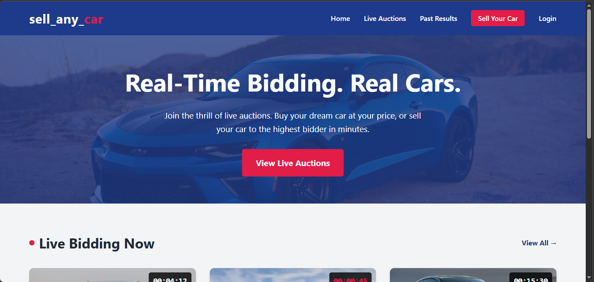
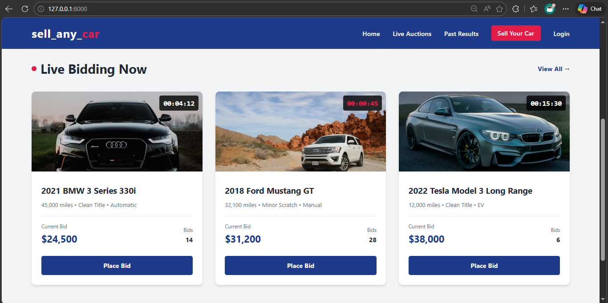
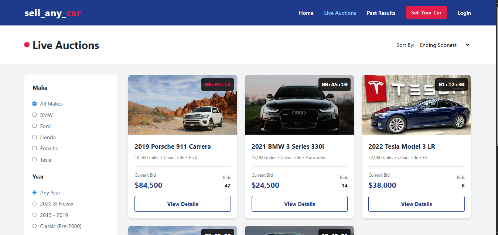

```markdown
# sell_any_car 🚗

> ⚠️ **NOTICE: This project is currently under development.** Features, UI, and database structures are actively being built and are subject to change.

## About the Project
**sell_any_car** is a live-bidding platform for used cars. It allows users to browse active car auctions, track countdown timers, and place real-time bids on vehicles. The backend is powered by Django.

## Screenshots

Here is a look at the current progress of the application:

### Homepage


### Live Auctions Page


### Auction Details (WIP)


---

## Getting Started

Follow these instructions to get a copy of the project up and running on your local machine for development and testing.

### Prerequisites

Before you begin, ensure you have Python installed on your computer. 
* You can download it here: [Install Python](https://www.python.org/downloads/)

### Installation & Setup

**1. Clone the repository and navigate into it:**
```bash
# If you are using git, clone it first. Otherwise, just open your terminal in the project folder.
cd sell_any_car

```

**2. Create a virtual environment:**
This keeps your project dependencies isolated.

```bash
python3 -m venv .venv

```

**3. Activate the virtual environment:**

* **On macOS/Linux:**
```bash
source .venv/bin/activate

```


* **On Windows:**
```bash
.venv\Scripts\activate

```


**4. Install Django:**

```bash
pip install django

```

*(Note: If you have a `requirements.txt` file later, use `pip install -r requirements.txt` instead).*

**5. Apply migrations (Setting up the database):**

```bash
python manage.py migrate

```

**6. Run the development server:**

```bash
python manage.py runserver

```

Once the server is running, open your web browser and go to `http://127.0.0.1:8000/` to view the site!

```
